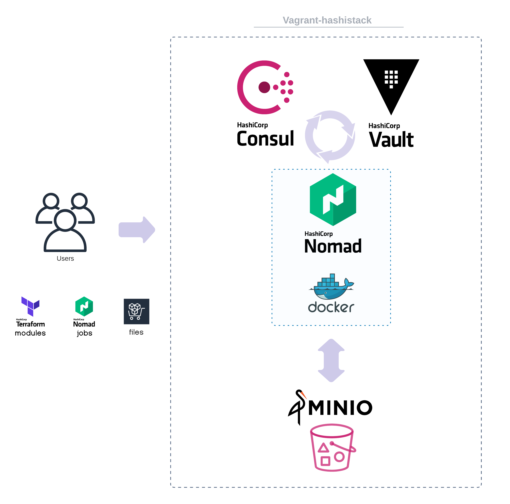

<p align="center">
 
 <h2 align="center">Vagrant-hashistack</h2>
 <p align="center">Hashistack in one click for development & testing</p>
</p>
<p align="center">
    <a href="https://github.com/fredrikhgrelland/vagrant-hashistack/actions">
      
    </a>
    <a href="https://github.com/fredrikhgrelland/vagrant-hashistack/releases">
      
    </a>
    <a href="https://github.com/fredrikhgrelland/vagrant-hashistack/commits">
      
    </a>
    <br />
    <br />
    <p align="center">
      <a href="https://app.vagrantup.com/fredrikhgrelland/boxes/hashistack" alt="Download og Vagrant Cloud">
            
        </a>
      <a href="https://github.com/fredrikhgrelland/vagrant-hashistack-template/generate" alt="Clone Template">
            
        </a>
    </p>
</p>

#

This vagrant box aims to make it dead simple to start a hashistack and emulate how services will be deployed to production.

---

> 🚧 - current vagrant box runs consul, nomad and vault in `dev` (development) mode.
- [consul development mode](https://learn.hashicorp.com/consul/getting-started/agent)
- [nomad development mode](https://learn.hashicorp.com/nomad/getting-started/running)
- [vault development mode](https://www.vaultproject.io/docs/concepts/dev-server)
---

## Content

1. [Description - what & why](#description---what--why)
   1. [Submodules](#submodules)
   2. [Services](#services)
   3. [Why does this exist?](#why-does-this-exist)
   4. [Installed stack](#installed-stack)
   5. [Versions](#versions)
2. [Install prerequisites](#install-prerequisites)
   1. [General requirements](#general-requirements)
      1. [Proxy](#proxy)
         1. [MacOS](#macos)
   2. [Linux requirements](#linux-requirements)
   3. [MacOS requirements](#macos-requirements)
   4. [Windows requirements](#windows-requirements)
      1. [GNU Make and Git Bash](#gnu-make-and-git-bash)
3. [Build](#build)
4. [Configuration](#configuration)
   1. [Default Configuration](#default-configuration)
   2. [Override default configuration](#override-default-configuration)
      1. [Option 1 - Change environment variables](#option-1---change-environment-variables)
      2. [Option 2 - Override configuration files](#option-2---override-configuration-files)
5. [Usage](#usage)
   1. [Option-1 Starting a plain default box](#option-1-starting-a-plain-default-box)
      1. [Port collisions](#port-collisions)
         1. [Option 1 Shut down the running machine](#option-1-shut-down-the-running-machine)
         2. [Option 2 Use the `auto_correct` feature to dynamically allocate ports](#option-2-use-the-auto_correct-feature-to-dynamically-allocate-ports)
   2. [Option-2 Starting a new project based on the template](#option-2-starting-a-new-project-based-on-the-template)
   3. [Custom port forwarding](#custom-port-forwarding)
6. [Test](#test)
   1. [Local run](#local-run)
   2. [CI pipeline run](#ci-pipeline-run)
      1. [CI test configuration](#ci-test-configuration)
7. [Diagram](#diagram)
8. [Contribute](#contribute)

## Description - what & why

This repository will build a [base-box](https://app.vagrantup.com/fredrikhgrelland/boxes/hashistack) for different projects to extend on.
The base-box contains components, and a setup that makes it ideal for working with the hashistack.

**Hashistack**, in current repository context, is a set of software products by [HashiCorp](https://www.hashicorp.com/).

### Submodules

Current repository contains [submodules](./.gitmodules)
- [vagrant-hashistack-template](https://github.com/fredrikhgrelland/vagrant-hashistack-template)

Check [Using submodules in Git - Tutorial](https://www.vogella.com/tutorials/GitSubmodules/article.html)

Current repository points to concrete commit in submodule(s)

**To point to the latest commit in submodule master**
```text
make update-submodule
```

### Services

The default box will start Nomad, Vault, Consul and MinIO bound to loopback and advertising on the IP `10.0.3.10`, which should be available on your local machine.
Port-forwarding for `nomad` on port `4646` should bind to `127.0.0.1` and should allow you to use the nomad binary to post jobs directly.
Consul and Vault have also been port-forwarded and are available on `127.0.0.1` on ports `8500` and `8200` respectively.
Minio is started on port `9000` and shares the `/vagrant` (your repo) from within the vagrant box.

|Service|URL|Token(s)|
|:---|:---:|:---:|
|Nomad| [http://10.0.3.10:4646](http://10.0.3.10:4646)||
|Consul| [http://10.0.3.10:8500](http://10.0.3.10:8500)|master|
|Vault| [http://10.0.3.10:8200](http://10.0.3.10:8200)|master|
|Minio| [http://10.0.3.10:9000](http://10.0.3.10:9000)|minioadmin : minioadmin|

### Why does this exist?

We needed a Vagrant box with the complete hashistack to use for demo, development and testing.
In order to build cloud native, security minded and dependable services, there exists a killer combination;
- Containers - ([Docker](https://www.docker.com/))
- Simple&Powerful Orchestrator - ([Nomad](https://www.nomadproject.io/))
- Service-mesh mTLS - ([Consul connect](https://www.consul.io/docs/connect))
- Secrets management - ([Vault](https://www.vaultproject.io/))

### Installed stack

- [Consul](https://www.consul.io/)
- [Nomad](https://www.nomadproject.io/)
- [Vault](https://www.vaultproject.io/)
- [Terraform](https://www.terraform.io/)
- [Docker CE](https://www.docker.com/)

**with a side-play of**

- [Ansible](https://www.ansible.com/)
- [Packer](https://www.packer.io/)
- [Consul-template](https://github.com/hashicorp/consul-template)
- [Minio](https://min.io/)

### Versions
| vagrant-hashistack | terraform | consul | nomad  | vault  | packer  | consul-template | remarks                  |
| ------------------ | :-------- |:-------|:-------|:-------| :------ |:----------------|:-------------------------|
| 0.6.0              |  0.13.4   | 1.8.4  | 0.12.5 | 1.5.4  | 1.6.4   | 0.25.1          |                          |
| 0.5.0              |  0.13.2   | 1.8.4  | 0.12.4 | 1.5.3  | 1.6.1   | 0.25.1          |                          |
| 0.4.3              |  0.13.2   | 1.8.4  | 0.12.4 | 1.5.3  | 1.6.1   | 0.25.1          |                          |
| 0.4.2              |  0.13.2   | 1.8.4  | 0.12.4 | 1.5.3  | 1.6.1   | 0.25.1          |                          |
| 0.4.1              |  0.13.2   | 1.8.4  | 0.12.3 | 1.5.3  | 1.6.1   | 0.25.1          |                          |
| 0.4.0              |  0.13.1   | 1.8.3  | 0.12.3 | 1.5.2  | 1.6.0   | 0.25.1          | vault 1.5.2.1+ent        |

## Install prerequisites

```text
make install
```

The command, will install:
- [VirtualBox](https://www.virtualbox.org/)
- [Packer](https://www.packer.io/)
- [Vagrant](https://www.vagrantup.com/) with additional plugins
- [Additional software dependent on the OS (Linux, MacOS)](install/Makefile)


### General requirements

You will need to have the following binaries pre-installed:

- [Make](https://man7.org/linux/man-pages/man1/make.1.html)
- [Git CLI](https://git-scm.com/book/en/v2/Getting-Started-The-Command-Line)

---

`NB` **Post installation you might need to reboot your system in order to start the virtual-provider (VirtualBox)**

*The rest of the Requirements are operative system dependent*

---

#### Proxy

If you for any reason find yourself behind a transparent proxy you need to set the environment variables `SSL_CERT_FILE` and `CURL_CA_BUNDLE`. You have three options:
- Prefix `vagrant up`; `SSL_CERT_FILE=<path/to/ca-certificates-file> CURL_CA_BUNDLE=<path/to/ca-certificates-file> vagrant up`
- Set the environment variables in your current session by running `export SSL_CERT_FILE=<path/to/ca-certificates-file>` and `export CURL_CA_BUNDLE=<path/to/ca-certificates-file>` in the terminal. Eg:`export SSL_CERT_FILE=/etc/ssl/certs/ca-certificates.crt CURL_CA_BUNDLE=/etc/ssl/certs/ca-certificates.crt`
- Set the environment variables permanently by adding the above export commands to your `~/.bashrc` or equivalent.

##### MacOS
MacOS uses its own keychain, which means you have no certificates-file to point to. You can solve this by exporting all certificates present in the keychain to a file. 

```bash
security find-certificate -a -p > certs.pem
```

The command above will export all system and personal certificates in your keychain to `certs.pem`. You can now follow the first steps, and point your env-variables to `certs.pem`.

### Linux requirements

- Virtualization must be enabled. [Error if it is not.](https://github.com/fredrikhgrelland/vagrant-hashistack/issues/136)
- Packages `gpg` and `apt` must be installed.

### MacOS requirements

- Virtualization must be enabled. [This is enabled by default on MacOS.](https://support.apple.com/en-us/HT203296)
- [Homebrew](https://brew.sh/) must be installed.

### Windows requirements

Most developers are likely to be using Linux or Mac as their development box, however the install procedure should also work on Windows.

#### GNU Make and Git Bash
- [Git](https://git-scm.com/download/win). Use the download link and follow the steps.

> :warning: Make sure to install Git Bash when installing Git

- [GNU Make](https://www.gnu.org/software/make/). Run the commands below in your Git Bash, or any other terminal.


```shell
curl -O https://managedway.dl.sourceforge.net/project/ezwinports/make-4.3-without-guile-w32-bin.zip
unzip -d "/c/Program Files/Git/mingw64" make-4.3-without-guile-w32-bin.zip
```

Next, make sure to start git bash as admin shell (start > Git Bash > rightclick > Run as administrator).
Now you are all set to run
```shell
make install
```

## Build

Make build will build a vagrant box based on [fredrikhgrelland/bionic64-ansible-docker](https://app.vagrantup.com/fredrikhgrelland/boxes/bionic64-ansible-docker). The packaged box will be locally available at ´packer/output-hashistack/package.box´
```text
make build
```

Make dev will build a vagrant box as `make build`, but without running the tests
```text
make dev
```

Make test runs through your ansible playbook test, you can give the box different attributes by adding them in the`.env` file under the `test/` directory 
```text
make test
```

This will destroy and take down your box if there is any
```text
make clean
```

> :bulb: You can refer to the [configuration](#configuration) section in order to get a comprehensive overview of the default configurations with which the system is set up.
The section also provides information about steps for overriding the default system configuration.

## Configuration
The vagrant-box is set up with a default configuration (see subsection [Default Configuration](#default-configuration)), but users may want to customize the vagrant-box services configuration to fit their needs.

In order to simplify making such changes in the configuration, we provide `switches`.
These switches are controlled by environment-variables, and provide the user with the opportunity to quickly switch between different configurations. 
The next sections will describe the defaults, and how to change them.

> :bulb: All supported switches are listed under `# Control box features` section in the [.env_default.j2](ansible/templates/.env_default.j2) file.

### Default Configuration
Each of the following links lead to the configuration file and is the default values when setting up the box.

#### Default configuration files
- [.env_default.j2](ansible/templates/.env_default.j2)
- [hashistack component versions](ansible/group_vars/all/variables.yml)
- [nomad policies](ansible/templates/conf/nomad/policies)
- [consul policies](ansible/templates/conf/consul/policies)

#### Defaults Consul
- Using open source version
- ACL [enabled=true](https://www.consul.io/docs/agent/options#acl_enabled)
- [default_policy=allow](https://www.consul.io/docs/agent/options#acl_default_policy)

#### Defaults Nomad
- Using open source version
- ACL [enabled=false](https://www.nomadproject.io/docs/configuration/acl#enabled)
- [Integrated with Consul, using token](ansible/templates/conf/nomad/020-acl.hcl.j2)
- [Integrated with Vault, using token](ansible/templates/conf/nomad/020-acl.hcl.j2)

#### Defaults Vault
- Using open source version
- [Unsealed](https://www.vaultproject.io/docs/concepts/seal)
- [PKI](https://www.hashicorp.com/products/vault/pki-with-vault) enabled at `/pki`

### Override default configuration
To override the default configuration you have two options:
- [Change the environment variables](#option-1---change-environment-variables)
- [Override the configuration files](#option-2---override-configuration-files)

> :warning: Overriding the configuration files will take effect last. In other words, using config files (Option 2) will override any configuration which were setup by the env variables (Option 1)

#### Option 1 - Change environment variables
When the vagrant box is provisioned, it reads the data from the following environment file `/home/vagrant/.env_default` in order to set up the system.
If you wish to override any of the default values then you can do so by adding that variable name and value in [.env](https://github.com/fredrikhgrelland/vagrant-hashistack-template/blob/master/dev/.env) file.
The property values in the `.env` file override the property values present in the `.env_default` file and thus makes it simple to provision systems that suffice the relevant development needs.

Say you want to do some tweaks and use Consul Enterprise, an open-source Nomad and Vault Enterprise. Then you would need to override the following variables:
- Consul Enterprise: 
    1. `consul_enterprise=true`
- Nomad open source:
    1. `nomad_enterprise=false`
- Vault Enterprise:
    1. `vault_enterprise=true`

In order to override the default configuration, the following needs to be added to the `.env` file:

```text
consul_enterprise=true
nomad_enterprise=false
vault_enterprise=true
```

#### Option 2 - Override configuration files
It is possible to add and/or override the hashistack components configuration files. See documentation [here](https://github.com/fredrikhgrelland/vagrant-hashistack-template/tree/master/dev/vagrant/conf).

## Usage

Vagrant-hashistack provides these features:
- Deploy & test terraform modules
- Deploy & test nomad jobs
- Upload files to Minio
- Test automation

### Option-1 Starting a plain default box

To get a running VM using the latest release of this box run

```text
vagrant init fredrikhgrelland/hashistack
vagrant up --provision
```

The first command will add a file called `Vagrantfile` to your directory, and `vagrant up` will start a box based on the specifications of that file.

`NB` **If you are behind a transparent proxy, follow [proxy documentation](#proxy)**

#### Port collisions
If you get the error message
```text
Vagrant cannot forward the specified ports on this VM, since they
would collide with some other application that is already listening
on these ports. The forwarded port to 8500 is already in use
on the host machine.
```
you do most likely have another version of the vagrant-box already running and using the ports. You can solve this in one of two ways:

##### Option 1 Shut down the running machine
Run
```bash
vagrant status
```
to see all running boxes. Then run
```bash
vagrant destroy <box-name>
```
to take it down. [Doc on what `vagrant destroy` does](https://www.vagrantup.com/docs/cli/destroy).

##### Option 2 Use the `auto_correct` feature to dynamically allocate ports
Vagrant has a configuration option called [auto_correct](https://www.vagrantup.com/docs/networking/forwarded_ports#auto_correct) which will use another port if the port specified is already taken. To enable it you can add the lines below to the bottom of your `Vagrantfile`.
```hcl
Vagrant.configure("2") do |config|
    # Hashicorp consul ui
    config.vm.network "forwarded_port", guest: 8500, host: 8500, host_ip: "127.0.0.1", auto_correct: true
    # Hashicorp nomad ui
    config.vm.network "forwarded_port", guest: 4646, host: 4646, host_ip: "127.0.0.1", auto_correct: true
    # Hashicorp vault ui
    config.vm.network "forwarded_port", guest: 8200, host: 8200, host_ip: "127.0.0.1", auto_correct: true
end
```
This will enable the autocorrect-feature on the ports used by consul, nomad, and vault.

> :bulb: You can find out more about Vagrantfiles [here](https://www.vagrantup.com/docs/vagrantfile)

### Option-2 Starting a new project based on the template

To see a full example of how to start a new project based on this box go to [template-repo](https://github.com/fredrikhgrelland/vagrant-hashistack-template).

`NB` **If you are behind a transparent proxy, follow [proxy documentation](#proxy)**

### Custom port forwarding

There is opportunity to forward ports from vagrant box instance to localhost using `vagrant ssh --`
```text
vagrant ssh -- --help

usage: ssh [-46AaCfGgKkMNnqsTtVvXxYy] [-B bind_interface]
           [-b bind_address] [-c cipher_spec] [-D [bind_address:]port]
           [-E log_file] [-e escape_char] [-F configfile] [-I pkcs11]
           [-i identity_file] [-J [user@]host[:port]] [-L address]
           [-l login_name] [-m mac_spec] [-O ctl_cmd] [-o option] [-p port]
           [-Q query_option] [-R address] [-S ctl_path] [-W host:port]
           [-w local_tun[:remote_tun]] destination [command]
```

> The syntax is `vagrant ssh -- -L <local machine port>:<host inside machine>:<port inside machine>`  

The example below shows how to forward MinIO (which is used as an artifact manager) port `:9000` from vagrant box to localhost port `:6666`
```text
vagrant ssh -- -L 6666:localhost:9000
```

> :bulb: Custom port forwarding `vagrant ssh --` command could be used in cases when you need to forward ports of consul-connect proxies from vagrant box to localhost machine  

> :bulb: cli command could take several args

Example
```text
vagrant ssh -- -L 7001:localhost:9999 -L 7002:localhost:9000
```

## Test

There are two options how to run tests:
- run all tests on local machine
- run all tests in CI (env variable CI)

Options are controlled by environment variable `CI`.

### Local run

`CI` env variable is not set.

```text
make test
```

The above command runs the tests by starting the [countdash](https://www.nomadproject.io/docs/integrations/consul-connect/) consul-connect example. If ´packer/output-hashistack/package.box´ does not exist, it will run ´make build´.


### CI pipeline run

`CI` env variable set to any non-null value.

```text
make test
```

The tests are run using [Github Actions](https://github.com/features/actions) feature which makes it possible to automate, customize, and execute the software development workflows right in the repository.

We utilize the **matrix testing strategy** to cover all the possible and logical combinations of the different properties and values that the components support.
The `.env_override` file is used by the tests to override the values that are available in the `.env_default` file, as well as the user configurable `.env` file.

Pay attention that we pass [extra-vars](https://docs.ansible.com/ansible/latest/user_guide/playbooks_variables.html#id35) `ci_test=true` to the ansible provisioner.
[Full example](https://github.com/fredrikhgrelland/vagrant-hashistack-template/blob/master/Makefile#L39)

#### CI test configuration

As of today, the following tests are executed whenever a `Pull request` is created :

| Test name                                                                                  | Consul Acl  |  Consul Acl Policy  |  Nomad Acl    | Hashicorp binary
|:------------------------------------------------------------------------------------------:|:------------|:-------------------:|:-------------:|:---------------:|
|    test (consul_acl_enabled, consul_acl_deny, nomad_acl_enabled, hashicorp_oss)            |  true       |  deny               |  true         | Open source     |
|    test (consul_acl_enabled, consul_acl_deny, nomad_acl_enabled, hashicorp_enterprise)     |  true       |  deny               |  true         | enterprise      |
|    test (consul_acl_enabled, consul_acl_deny, nomad_acl_disabled, hashicorp_oss)           |  true       |  deny               |  false        | Open source     |
|    test (consul_acl_enabled, consul_acl_deny, nomad_acl_disabled, hashicorp_enterprise)    |  true       |  deny               |  false        | enterprise      |
|    test (consul_acl_disabled, consul_acl_deny, nomad_acl_enabled, hashicorp_oss)           |  false      |  deny               |  true         | Open source     |
|    test (consul_acl_disabled, consul_acl_deny, nomad_acl_enabled, hashicorp_enterprise)    |  false      |  deny               |  true         | enterprise      |
|    test (consul_acl_disabled, consul_acl_deny, nomad_acl_disabled, hashicorp_oss)          |  false      |  deny               |  false        | Open source     |
|    test (consul_acl_disabled, consul_acl_deny, nomad_acl_disabled, hashicorp_enterprise)   |  false      |  deny               |  false        | enterprise      |

The latest test results can be looked up under the Actions tab [Actions](https://github.com/fredrikhgrelland/vagrant-hashistack/actions)

## Diagram



## Contribute

[See here](docs/CONTRIBUTING.md)
