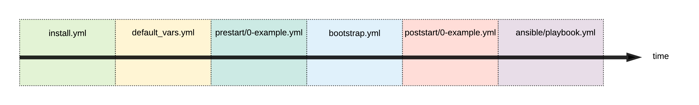

# Starter template for `fredrikhgrelland/hashistack`

This repository can be used as a base for developing services on the hashistack.
On github, you may use the ["Use this template"](https://github.com/fredrikhgrelland/vagrant-hashistack-template/generate) button to generate a new repository from this template.

If you found this in `fredrikhgrelland/vagrant-hashistack`, you may be interested in this separate repository [vagrant-hashistack-template](https://github.com/fredrikhgrelland/vagrant-hashistack-template/generate) button to start a new repository from this repo
.

Documentation on [parent repository](https://github.com/fredrikhgrelland/vagrant-hashistack#usage).

## Customizing the vagrant box
The vagrant box ships with a default startup scheme. It will run an ansible playbook to start all services.
You may change the hashistack configuration or add aditional pre and post steps to the startup procedure to match your needs.

### Overriding and extending the configuration of the hashistack

- consul [vagrant/conf/hashistack/consul/99-override.hcl](vagrant/conf/hashistack/consul/99-override.hcl)
- nomad [vagrant/conf/hashistack/nomad/99-override.hcl](vagrant/conf/hashistack/nomad/99-override.hcl)
- vault [vagrant/conf/hashistack/vault/99-override.hcl](vagrant/conf/hashistack/vault/99-override.hcl)

You may edit the `99-override.hcl` or add your own.
Any valid configuration added to these directories will be added to their respective services' configuration, in lexical order.

#### Config variations
We provide some config variations as additional functionality, which you may want to use.
Current supported variations:
```text
* ACL default policy for consul (deny or allow)
```
To choose other config variation you need to override ansible variables. There are two options how to override ansible variables:
* First option via `ANSIBLE_AGRS`
```bash
ANSIBLE_ARGS='--extra-vars "consul_agent_acl_default_policy=deny"' vagrant up --provision
```
* Second option via prestart, adding fact in `vagrant/conf/ansible/playbooks/prestart/0-example.yml`
```yaml
# Option 2 how to turn on ACL
# [ACL] Set 'deny' default policy for consul agent
- set_fact: consul_agent_acl_default_policy="deny"
```

Full set of extra_variables could be found [default_vars.yml](../ansible/default_vars.yml)

### Pre- and post-startup ansible playbooks
This vagrant box will execute ansible playbooks put in two special directories [vagrant/conf/ansible/playbooks/prestart](vagrant/conf/ansible/playbooks/prestart) and [vagrant/conf/ansible/playbooks/poststart](vagrant/conf/ansible/playbooks/poststart). These playbooks will be executed before and after the box's bundled startup sequence, respectively. This gives the flexibility to configure all aspects of the hashistack as well as run tasks needed for tests or demo purposes as part of `vagrant up` Note; The playbooks are included into the main run, so the syntax in the [example](vagrant/conf/ansible/playbooks/prestart/0-example.yml) must be followed..  
They will be run in lexical order, and prefixing with numbers is a good way to get the order you want.

### Vagrant box life-cycle

1. `install.yml` - installing required software
2. `default_vars.yml` - setup default ansible variables
3. `prestart/*.yml` - prestart scripts, running before hashistack software will start
4. `bootstrap.yml` - verify ansible variables and software configuration, run hashistack software & verify that it started correctly
5. `poststart/*.yml` - poststart scripts, running after hasistack software runs and ready
6. `ansible/playbook.yml` - user's provisioning playbook
